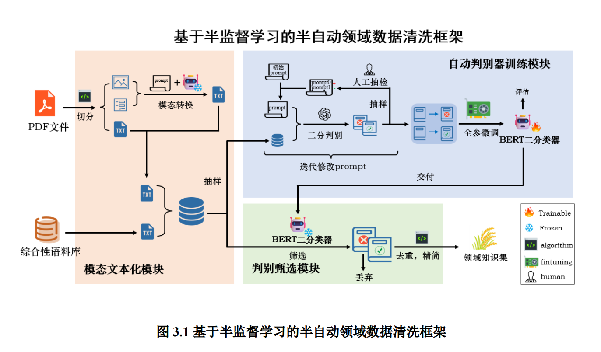

# HNU-CleanFrame for SeedLLM


## Theory & Frame



## How to start

```bash
conda create -n CF python=3.10
conda activate CF
pip install -r requirements.txt
```

## How to use

Pipeline

```

```

分模块作用

```bash
# 模态文本化模块
# 修改main函数中的目标文件夹，默认为test文件夹（提供了一些示例）
python textify.py
# 该步骤的结果输出到output_text文件夹中

```

## Others

BERT二分类器参考工作：[Bert-Chinese-Text-Classification-Pytorch](https://github.com/649453932/Bert-Chinese-Text-Classification-Pytorch)
